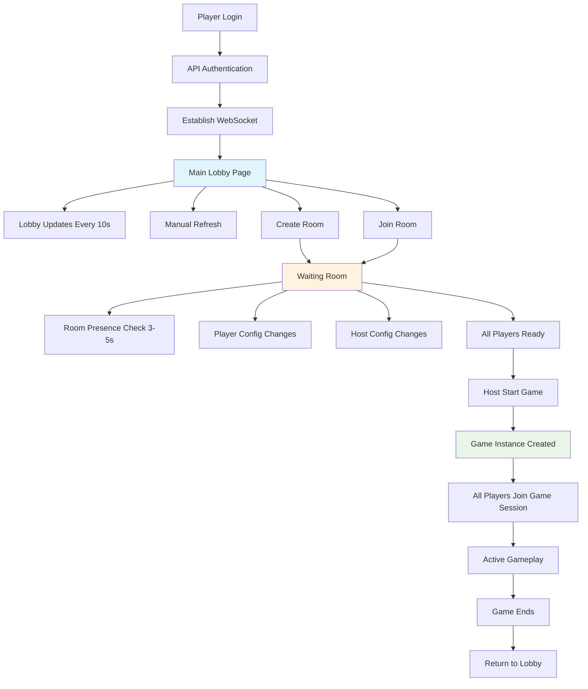

# Lobby and Room Architecture Separation

## Overview

This document outlines the new modular architecture that cleanly separates **Lobby** (main lobby), **Room** (waiting room), and **Game Instance** (actual gameplay) concerns, making the codebase easier to understand, maintain, and extend.

## Key Concepts

### 🏛️ **Lobby System** (Main Lobby Page)
- **Purpose**: After logged in, player will be in a lobby where player can join or create a room, or config self profile (Skin, Portrait)
- **Behavior**: The lobby will be updated automatically every 10 seconds, or when a player clicked on refresh btn
- **Location**: `Server/Entity/Lobby/`
- **Manager**: `LobbyManager.ts`
- **Data Type**: `LobbyRoom`

### 🎮 **Room System** (Waiting Room, not the Game instance yet)
- **Purpose**: After created, this will be a room where player waiting for other to join, or config self profile, plus the host can change some room configs too
- **Room config**: Number of players, map size, random seed the map, add AI player with AI difficulty (AI player will be implement later, So skip the idea)
- **Location**: `Server/Entity/Room/`
- **Manager**: `RoomManager.ts` 
- **Data Type**: `WaitingRoom`

### 🎯 **Game Instance** (Actual Game Room)
- **Purpose**: Actual place where game instance, all the logic about the game is here, not outside
- **Manager**: `GameManager.ts`
- **Data Type**: `GameRoom`

## System Flow



## Detailed Flow

### 1. Player Login & Lobby Entry
```
Player login (guest/registered) → API login → Establish WS → Lobby room/page
- Server broadcast lobby state every 10 secs
- Player can refresh manually
```

### 2. Room Creation/Joining
```
Player Create/Join room → send WS join/create → If success → Player goes into Waiting Room
```

### 3. Waiting Room State Management
```
- Server tracks player presence every 3-5 secs
- Server needs session manager to track where player is now
- Handle F5/refresh to keep player in same room
- Any player change triggers WS update to other players
```

### 4. Game Start Transition
```
All players ready → Host ready btn active → Host clicks start → 
Server sends WS → All players join game session
```

## System Responsibilities

### LobbyManager (`Server/Entity/Lobby/LobbyManager.ts`)

**Handles main lobby:**
- ✅ Show available rooms list
- ✅ Room creation/joining
- ✅ Player profile management
- ✅ Lobby state broadcasting (10s intervals)
- ✅ Manual refresh handling

**Key Methods:**
- `getLobbyRoomList()` - Get all available waiting rooms
- `createWaitingRoom()` - Create a new waiting room
- `joinWaitingRoom()` - Join an existing waiting room
- `updatePlayerProfile()` - Update player skin/portrait
- `broadcastLobbyState()` - Send lobby updates to all players

### RoomManager (`Server/Entity/Room/RoomManager.ts`)

**Handles waiting rooms:**
- ✅ Waiting room state management
- ✅ Player presence tracking (3-5s intervals)
- ✅ Player configuration changes
- ✅ Host room configuration
- ✅ Ready state management
- ✅ Game start preparation

**Key Methods:**
- `createWaitingRoom()` - Create waiting room from lobby
- `joinWaitingRoom()` - Handle player joining
- `leaveWaitingRoom()` - Handle player leaving
- `updatePlayerConfig()` - Player character/profile changes
- `updateRoomConfig()` - Host changes room settings
- `toggleReady()` - Player ready state
- `startGame()` - Transition to game instance

### GameManager (`Server/Entity/Game/GameManager.ts`)

**Handles actual gameplay:**
- ✅ Game instance creation from waiting room
- ✅ Active gameplay mechanics
- ✅ Turn management
- ✅ Game state persistence
- ✅ Player reconnection to active games

**Key Methods:**
- `createGameInstance()` - Create game from waiting room
- `handlePlayerAction()` - Process game actions
- `manageGameState()` - Update and sync game state
- `handleReconnection()` - Player rejoins active game

### SessionManager (`Server/Entity/SessionManager.ts`)

**Handles player state tracking:**
- ✅ Track where each player is (lobby/waiting room/game)
- ✅ Handle F5/refresh reconnection
- ✅ Player location persistence
- ✅ Cross-system player tracking

**Key Methods:**
- `trackPlayerLocation()` - Update player's current location
- `getPlayerLocation()` - Get where player currently is
- `handleReconnection()` - Restore player to correct location
- `cleanupDisconnectedPlayers()` - Remove inactive players

## Message Types

### Lobby Messages
```typescript
// Client to Server
"lobby-get-rooms" | "lobby-create-room" | "lobby-join-room" | 
"lobby-refresh" | "lobby-update-profile"

// Server to Client  
"lobby-rooms-list" | "lobby-room-created" | "lobby-room-joined" |
"lobby-state-update" | "lobby-profile-updated"
```

### Waiting Room Messages
```typescript
// Client to Server
"room-update-config" | "room-update-player" | "room-toggle-ready" |
"room-start-game" | "room-leave" | "room-presence-response"

// Server to Client
"room-state-update" | "room-player-joined" | "room-player-left" |
"room-config-updated" | "room-ready-updated" | "room-game-starting" |
"room-presence-check"
```

### Game Instance Messages
```typescript
// Client to Server
"game-action" | "game-end-turn" | "game-reconnect" | "game-presence-response"

// Server to Client
"game-state-update" | "game-turn-update" | "game-action-result" |
"game-ended" | "game-presence-check"
```

## Data Types

### PlayerLocation (Session Tracking)
```typescript
interface PlayerLocation {
  userId: string;
  location: 'lobby' | 'waiting-room' | 'game-instance';
  roomId?: string;
  gameId?: string;
  lastSeen: Date;
}
```

### WaitingRoom
```typescript
interface WaitingRoom {
  id: string;
  name: string;
  hostId: string;
  state: "WAITING" | "STARTING";
  config: {
    maxPlayers: 2 | 3 | 4;
    mapSize: 'small' | 'medium' | 'large';
    mapSeed: string;
    aiPlayers?: number; // Future feature
  };
  players: WaitingRoomPlayer[];
  createdAt: Date;
}
```

### WaitingRoomPlayer
```typescript
interface WaitingRoomPlayer {
  userId: string;
  username: string;
  userType: 'registered' | 'guest';
  isReady: boolean;
  character: PlayerCharacterSetup;
  profile: {
    skinId?: string;
    portraitId?: string;
  };
  lastSeen: Date;
}
```

### GameInstance
```typescript
interface GameInstance {
  id: string;
  waitingRoomId: string; // Reference to originating waiting room
  hostId: string;
  state: "STARTING" | "PLAYING" | "FINISHED";
  config: WaitingRoomConfig;
  players: GamePlayer[];
  gameState: GameState;
  turnOrder: string[];
  currentPlayer: string;
  currentTurn: number;
  createdAt: Date;
  startedAt: Date;
}
```

## Presence Check Strategy

### Lobby (10 seconds)
- Broadcast lobby state to all lobby players
- Remove inactive players from lobby
- Update room list

### Waiting Room (3-5 seconds)
- Check each player's presence in waiting room
- Handle player reconnection to same room on F5
- Update room state to other players
- Critical for ready state management

### Game Instance (5-7 seconds)
- Check active game players
- Handle game reconnection
- Pause/resume game based on player availability
- Save game state for reconnection

## Session Management

### Player Location Tracking
```typescript
class SessionManager {
  private playerLocations: Map<string, PlayerLocation> = new Map();
  
  // Track where player is
  setPlayerLocation(userId: string, location: PlayerLocation)
  getPlayerLocation(userId: string): PlayerLocation | null
  
  // Handle reconnection
  handlePlayerReconnection(userId: string, ws: WebSocket)
  
  // Cleanup
  removeInactivePlayers()
}
```

### Reconnection Strategy
1. **Player connects** → Check `playerLocations`
2. **Found in lobby** → Send to lobby with current state
3. **Found in waiting room** → Rejoin waiting room with current state  
4. **Found in game** → Reconnect to active game instance
5. **Not found** → Start fresh in lobby

## Implementation Priorities

### Phase 1: Core Flow ✅
- [x] Basic lobby system
- [x] Waiting room creation/joining
- [x] Player state management
- [x] Message type separation

### Phase 2: Session Management 🔄
- [ ] SessionManager implementation
- [ ] Player location tracking
- [ ] Reconnection handling
- [ ] Presence check optimization

### Phase 3: Game Instance 📋
- [ ] GameManager implementation
- [ ] Waiting room → Game transition
- [ ] Active gameplay mechanics
- [ ] Game state persistence

### Phase 4: Polish & Features 🚀
- [ ] Profile management (skins/portraits)
- [ ] Room configuration UI
- [ ] Advanced reconnection
- [ ] AI players (future)

## Benefits

### 🎯 **Clear State Management**
- Each player's location is tracked
- Predictable state transitions
- Easy reconnection logic

### 🔄 **Robust Reconnection**
- F5/refresh keeps player in same location
- Session persistence across connections
- Graceful handling of connection issues

### 📊 **Optimized Presence Checking**
- Different intervals for different needs
- Lobby: 10s (less critical)
- Waiting Room: 3-5s (critical for ready states)
- Game: 5-7s (balanced for gameplay)

### 🏗️ **Scalable Architecture**
- Clear separation of concerns
- Easy to add new features
- Independent system testing

This architecture provides a solid foundation for tracking player states, handling reconnections, and managing the complete flow from lobby to active gameplay!
