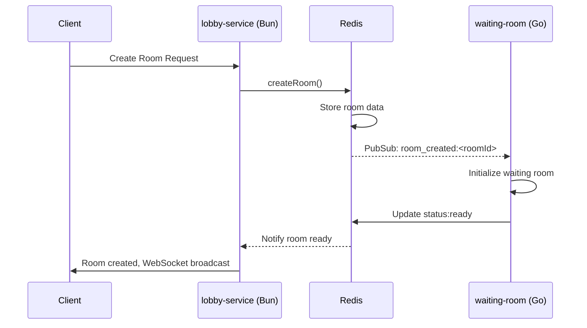
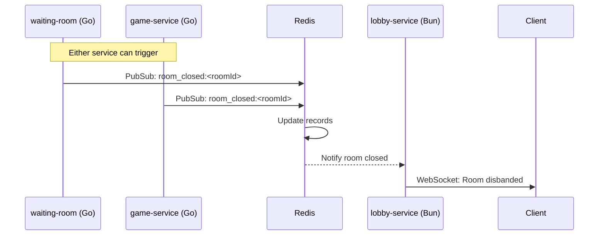

# Scalable Multiplayer Game Platform Architecture

## Overview

This document outlines the new scalable architecture for The Kingsmaker multiplayer game platform, designed for a solo developer with focus on Redis as the central state manager and service separation by responsibility.

## 🏛️ Core Services Architecture

| Service | Language | Role | Responsibility |
|---------|----------|------|----------------|
| **auth-service** | Bun | Authentication | Handles login, register, guest login, and session issuing |
| **lobby-service** | Bun | Lobby Management | Shows player list, room list, manages WebSocket connections |
| **waiting-room** | Go | Pre-Game Setup | One per match; handles pre-game setup and sync |
| **game-service** | Go | Game Logic | One per active game; isolated logic per instance |
| **redis-manager** | Redis | State Management | Central state: logged-in users, rooms, pub/sub for inter-service |

## 🔄 Redis as Smart Shared State Manager

Redis serves as the central nervous system for all services, managing state and inter-service communication:

### State Managers

| Manager Role | Redis Usage | Purpose |
|--------------|-------------|---------|
| **loggedInUserManager** | `SET loggedInUsers:<sessionId>` → user ID, expire w/ TTL | Track active user sessions |
| **waitingRoomsManager** | `HASH waitingRooms:<roomId>` → players, room metadata | Manage waiting room state |
| **gamesManager** | `SET games:<roomId>` → game state ref / status | Track active games |

### Pub/Sub Channels

| Channel | Purpose | Triggered By |
|---------|---------|--------------|
| `room_created` | New room available | lobby-service |
| `room_closed` | Room disbanded | waiting-room/game-service |
| `game_start` | Game instance starting | waiting-room |
| `player_joined` | Player joined room | lobby-service |
| `player_left` | Player left room | lobby-service |

## 🔗 Communication Flow

### Room Creation Flow

### Room Disband / Game End Flow

## 🌐 WebSocket Management Strategy

### Connection Architecture
- **lobby-service**: Holds primary WebSocket connections to all clients
- **waiting-room**: Dedicated WS per room (Go handles it), isolated per room
- **game-service**: Dedicated WS per game instance, completely decoupled from lobby

### Client Connection Rules
- Clients **never** directly connect to Redis or internal Go services
- All communication flows through the appropriate Bun or Go service layer
- WebSocket connections are service-specific and purpose-built

## 🧠 Concurrency Strategy

### Language Selection Rationale
- **Bun**: Used for auth and lobby services where I/O performance and rapid development matter
- **Go**: Used where high concurrency is critical (waiting-room and game instances)
- **Redis**: Enables complete decoupling + shared memory across all services

### Isolation Strategy
- Each game/room runs in its own Go routine or process
- Complete state isolation between game instances
- Redis provides the only shared state layer

## 🛠️ Tech Stack Overview

| Area | Technology | Purpose |
|------|------------|---------|
| **Frontend** | React + ChakraUI | User interface with WebSocket for real-time updates |
| **Backend Services** | Bun (auth, lobby) + Go (room/game) | Service separation by responsibility and performance needs |
| **State Management** | Redis | Central state + pub/sub communication |
| **Infrastructure** | Redis (local), optional Docker | Simple deployment, no external dependencies |

## 📋 Service Responsibilities

### auth-service (Bun)
- **Authentication**: Login, register, guest login
- **Session Management**: JWT token issuing and validation
- **User Persistence**: Store user data and preferences
- **Redis Integration**: Store active sessions with TTL

### lobby-service (Bun)
- **WebSocket Management**: Primary client connections
- **Room Discovery**: List available rooms
- **Player Management**: Show online players
- **Redis Integration**: Read room states, publish player events

### waiting-room (Go)
- **Pre-Game Setup**: Room configuration and player readiness
- **Concurrency**: Handle multiple rooms simultaneously
- **State Sync**: Synchronize player states before game start
- **Redis Integration**: Subscribe to room events, update room status

### game-service (Go)
- **Game Logic**: Isolated game instances
- **Turn Management**: Handle player actions and game state
- **High Performance**: Optimized for concurrent game sessions
- **Redis Integration**: Publish game events, store game results

### redis-manager (Redis)
- **State Storage**: Centralized state for all services
- **Pub/Sub**: Inter-service communication
- **Session Management**: TTL-based session expiry
- **Data Persistence**: Configurable persistence for critical data

## 🔒 System Benefits

### Scalability
- Services can be scaled independently based on load
- Redis provides natural horizontal scaling path
- Go services handle high-concurrency game logic efficiently

### Maintainability
- Clear separation of concerns
- Each service has focused responsibility
- Redis eliminates complex inter-service dependencies

### Solo Developer Friendly
- Technologies chosen for rapid development (Bun) and performance (Go)
- Redis reduces infrastructure complexity
- Clear architectural boundaries prevent feature creep

## 🚀 Deployment Strategy

### Development
- All services run locally
- Single Redis instance
- Hot reload for Bun services

### Production
- Docker containers for easy deployment
- Redis with appropriate persistence settings
- Load balancer for client-facing services (auth, lobby)

## 🔄 Migration Path

This architecture supports incremental migration:
1. Start with auth-service in Bun
2. Implement lobby-service with Redis integration
3. Port waiting-room logic to Go
4. Isolate game-service in Go
5. Optimize Redis usage patterns

The modular design allows for gradual implementation while maintaining a working system throughout the migration process.
