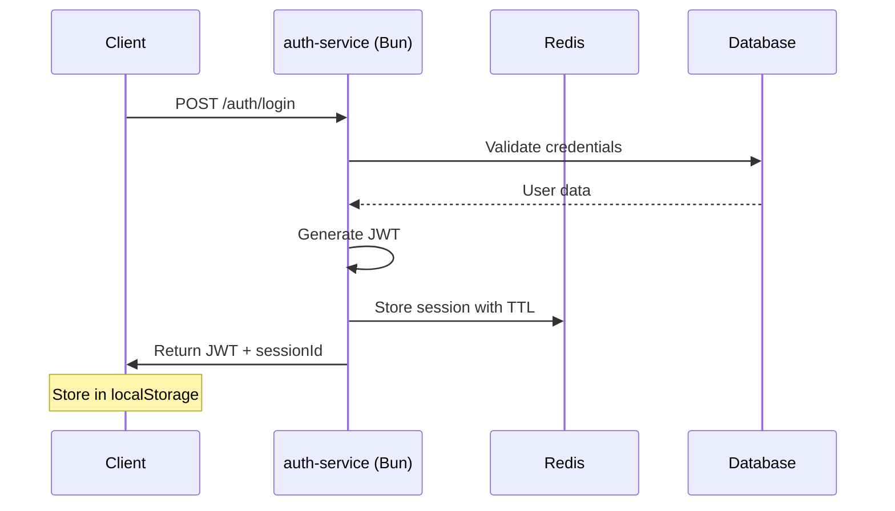
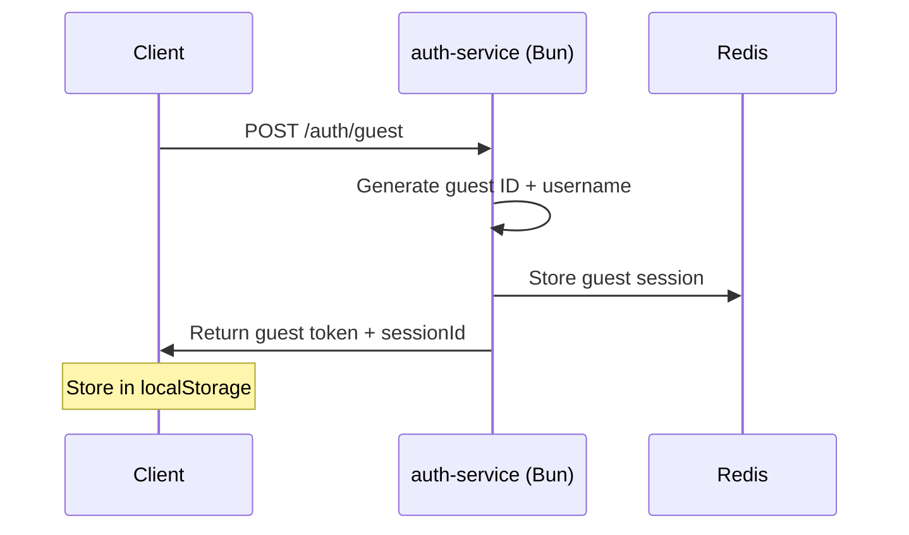

# KingsMaker Auth & Session System Architecture (Bun + Redis)

## Overview

KingsMaker auth-service is built with Bun for high performance I/O and uses Redis for centralized session management. The system supports both registered users and guest users, with a focus on simplicity and scalability.

## 🏗️ Technology Stack

### Core Technologies
- **Runtime**: Bun (fast I/O, built-in JWT support)
- **Session Storage**: Redis (centralized state with TTL)
- **Authentication**: JWT tokens for registered users, UUID sessions for guests
- **Communication**: HTTP REST API with JSON responses
- **Database**: Existing database for persistent user data

---

## 👥 User Types

### 1. Registered User
- **Registration**: Via email, username, password
- **Persistent Data**:
  - User profile and statistics
  - Achievements and unlockables
  - Game history and preferences
- **Authentication**: Email + password → JWT token
- **Session**: Redis-stored session with TTL

### 2. Guest User
- **Registration**: Auto-generated with random username
- **Persistent Data**: 
  - Session-based statistics only
  - No achievements or unlockables
  - Temporary game history
- **Authentication**: No credentials required
- **Session**: Redis-stored guest session with TTL

---

## 🔑 Session & Token Management

### Token Architecture

| Type | Format | User Type | Storage | Lifetime | Purpose |
|------|--------|-----------|---------|----------|---------|
| **JWT Token** | `eyJ...` | Registered | Redis + Client | 24h sliding | Auth for registered users |
| **Guest Session** | `guest_<uuid>` | Guest | Redis + Client | Browser session | Auth for guest users |
| **Session ID** | `session_<uuid>` | Both | Redis only | Connection lifetime | WebSocket connections |

### Session Data Structure in Redis

```typescript
// Registered User Session
interface RegisteredUserSession {
  type: "registered";
  userId: string;
  username: string;
  email: string;
  permissions: string[];
  issuedAt: string;
  lastActivity: string;
}

// Guest User Session  
interface GuestUserSession {
  type: "guest";
  userId: string; // guest_<uuid>
  username: string; // "Guest-123"
  generatedAt: string;
  lastActivity: string;
}
```

### Redis Key Structure

```typescript
// Session storage keys
"session:<sessionId>": RegisteredUserSession | GuestUserSession; // TTL: 24 hours
"user-sessions:<userId>": string[]; // Array of active session IDs
"guest-cleanup:<userId>": string; // TTL: Browser session length
```

---

## 🔄 Authentication Flow

### Registered User Authentication



### Guest User Authentication



---

## 📡 API Endpoints

### Authentication Endpoints
```typescript
// Registration and Login
POST /auth/register
Body: { email: string; username: string; password: string }
Response: { token: string; sessionId: string; user: UserProfile }

POST /auth/login  
Body: { email: string; password: string }
Response: { token: string; sessionId: string; user: UserProfile }

POST /auth/guest
Body: { preferredUsername?: string }
Response: { token: string; sessionId: string; user: GuestProfile }

// Session Management
POST /auth/refresh
Headers: { Authorization: "Bearer <token>" }
Response: { token: string; expiresAt: string }

POST /auth/logout
Headers: { Authorization: "Bearer <token>" }
Response: { success: boolean }

// User Information
GET /auth/me
Headers: { Authorization: "Bearer <token>" }
Response: { user: UserProfile; sessionInfo: SessionInfo }
```

### Session Validation (Internal)
```typescript
// Used by other services via Redis
GET /internal/validate-session/<sessionId>
Response: { valid: boolean; user?: UserSession }
```

---

## 🛡️ Security Implementation

### Password Security
```typescript
// Using Bun's built-in crypto
import { password } from "bun";

// Hash password on registration
const hashedPassword = await password.hash(plainPassword, {
  algorithm: "argon2id",
  memoryCost: 19456, // 19 MiB
  timeCost: 2,
});

// Verify on login
const isValid = await password.verify(plainPassword, hashedPassword);
```

### JWT Security
```typescript
// JWT configuration
const jwtConfig = {
  algorithm: 'HS256',
  expiresIn: '24h',
  issuer: 'kingsmaker-auth',
  audience: 'kingsmaker-game',
};

// Token validation middleware
async function validateJWT(token: string): Promise<UserPayload | null> {
  try {
    const payload = jwt.verify(token, process.env.JWT_SECRET!);
    // Additional Redis session check
    const session = await redis.get(`session:${payload.sessionId}`);
    return session ? JSON.parse(session) : null;
  } catch {
    return null;
  }
}
```

### Session Security
- **TTL Management**: Automatic session expiry via Redis TTL
- **Session Rotation**: New session ID on each login
- **Concurrent Sessions**: Limited number of active sessions per user
- **Guest Cleanup**: Automatic cleanup of abandoned guest sessions

---

## 🔄 Session Lifecycle Management

### Session Creation
```typescript
async function createSession(user: User): Promise<SessionResponse> {
  const sessionId = `session_${crypto.randomUUID()}`;
  const sessionData = {
    type: user.type,
    userId: user.id,
    username: user.username,
    email: user.email, // Only for registered users
    issuedAt: new Date().toISOString(),
    lastActivity: new Date().toISOString(),
  };
  
  // Store in Redis with TTL
  await redis.setex(`session:${sessionId}`, 86400, JSON.stringify(sessionData));
  
  // Track user sessions
  await redis.sadd(`user-sessions:${user.id}`, sessionId);
  
  return { sessionId, sessionData };
}
```

### Session Refresh
```typescript
async function refreshSession(sessionId: string): Promise<boolean> {
  const session = await redis.get(`session:${sessionId}`);
  if (!session) return false;
  
  const sessionData = JSON.parse(session);
  sessionData.lastActivity = new Date().toISOString();
  
  // Extend TTL and update data
  await redis.setex(`session:${sessionId}`, 86400, JSON.stringify(sessionData));
  return true;
}
```

### Session Cleanup
```typescript
// Cleanup expired sessions (background job)
async function cleanupExpiredSessions(): Promise<void> {
  const userKeys = await redis.keys('user-sessions:*');
  
  for (const userKey of userKeys) {
    const sessions = await redis.smembers(userKey);
    for (const sessionId of sessions) {
      const exists = await redis.exists(`session:${sessionId}`);
      if (!exists) {
        await redis.srem(userKey, sessionId);
      }
    }
  }
}
```

---

## 🔗 Integration with Other Services

### Redis-based Session Validation
Other services validate sessions through Redis:

```typescript
// Used by lobby-service, waiting-room, game-service
async function validateSession(sessionId: string): Promise<UserSession | null> {
  const sessionData = await redis.get(`session:${sessionId}`);
  if (!sessionData) return null;
  
  const session = JSON.parse(sessionData);
  
  // Update last activity
  session.lastActivity = new Date().toISOString();
  await redis.setex(`session:${sessionId}`, 86400, JSON.stringify(session));
  
  return session;
}
```

### WebSocket Authentication
```typescript
// WebSocket connection handler
async function authenticateWebSocket(ws: WebSocket, sessionId: string): Promise<UserSession | null> {
  const session = await validateSession(sessionId);
  if (!session) {
    ws.close(1008, 'Invalid session');
    return null;
  }
  return session;
}
```

---

## 📊 Session Monitoring & Analytics

### Session Metrics
```typescript
interface SessionMetrics {
  activeUsers: number;
  activeSessions: number;
  guestUsers: number;
  registeredUsers: number;
  averageSessionDuration: number;
  sessionsCreatedToday: number;
}

async function getSessionMetrics(): Promise<SessionMetrics> {
  const allSessions = await redis.keys('session:*');
  const metrics = {
    activeSessions: allSessions.length,
    // ... calculate other metrics
  };
  return metrics;
}
```

### Health Checks
```typescript
// Health endpoint
GET /auth/health
Response: {
  status: "healthy" | "degraded" | "unhealthy";
  redis: { connected: boolean; latency: number };
  sessions: { active: number; errors: number };
  uptime: number;
}
```

---

## 🚀 Performance Optimization

### Redis Connection Pooling
```typescript
import { Redis } from 'ioredis';

const redis = new Redis({
  host: process.env.REDIS_HOST,
  port: parseInt(process.env.REDIS_PORT || '6379'),
  maxRetriesPerRequest: 3,
  retryDelayOnFailover: 100,
  lazyConnect: true,
  maxMemoryPolicy: 'allkeys-lru',
});
```

### Caching Strategy
- **Session Cache**: Redis as primary session store
- **User Profile Cache**: Cache frequently accessed user data
- **Rate Limiting**: Redis-based rate limiting for auth endpoints
- **Token Blacklist**: For logout and security scenarios

---

## 🔧 Environment Configuration

```env
# Service Configuration
AUTH_PORT=3000
AUTH_JWT_SECRET=your-super-secret-key-here
AUTH_SESSION_TTL=86400

# Redis Configuration  
REDIS_HOST=localhost
REDIS_PORT=6379
REDIS_PASSWORD=
REDIS_DB=0

# Security Configuration
BCRYPT_ROUNDS=12
MAX_LOGIN_ATTEMPTS=5
RATE_LIMIT_WINDOW=900000
RATE_LIMIT_MAX=100

# Guest Configuration
GUEST_USERNAME_PREFIX=Guest
GUEST_SESSION_TTL=3600
```

---

## 🎯 Benefits

### For Development
- **Bun Performance**: Fast I/O and built-in optimizations
- **Redis Simplicity**: Centralized session management
- **Type Safety**: Full TypeScript support
- **Easy Testing**: In-memory Redis for tests

### For Operations  
- **Scalability**: Horizontal scaling with Redis clustering
- **Monitoring**: Built-in metrics and health checks
- **Security**: Modern authentication best practices
- **Maintenance**: Automatic session cleanup and monitoring

### For Users
- **Fast Authentication**: Sub-100ms response times
- **Seamless Experience**: Persistent sessions across reconnections
- **Guest Friendly**: No barriers to entry for new players
- **Security**: Secure session management and token handling

This architecture provides a robust, scalable authentication system that aligns perfectly with the Redis-centered multiplayer game platform while maintaining simplicity for solo development. 