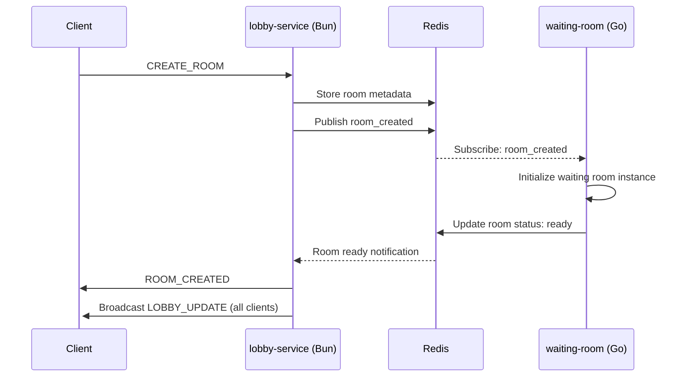
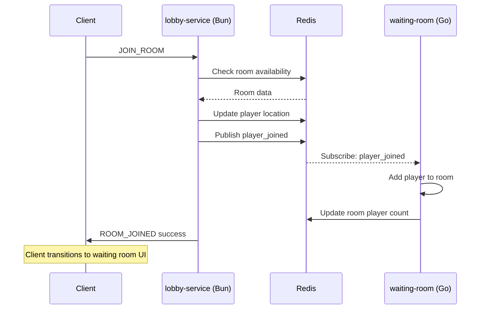

# KingsMaker Lobby Service Architecture (Bun + Redis)

## Overview

The lobby service is built with Bun for high I/O performance and uses Redis as the central state manager. It handles WebSocket connections from all clients and manages room discovery, player lists, and room creation/joining operations.

## 🏗️ Service Architecture

### Technology Stack
- **Runtime**: Bun (for fast I/O and WebSocket handling)
- **State Storage**: Redis (centralized state management)
- **Communication**: WebSocket (real-time client communication)
- **Inter-Service**: Redis Pub/Sub (communication with Go services)

### Core Components
- **lobby-service**: Main Bun service handling client connections
- **Redis State Managers**: Centralized state storage and pub/sub
- **WebSocket Manager**: Client connection management
- **Room Discovery**: Available room listing and filtering

---

## 🔄 Redis State Management

### State Structure
```typescript
// Redis Keys Structure
interface RedisStateStructure {
  // User session tracking
  "loggedInUsers:<sessionId>": string; // user ID, with TTL
  
  // Waiting room metadata
  "waitingRooms:<roomId>": {
    id: string;
    name: string;
    hostId: string;
    state: "WAITING" | "STARTING" | "IN_PROGRESS";
    maxPlayers: number;
    currentPlayers: number;
    createdAt: string;
  };
  
  // Room player details
  "waitingRoomPlayers:<roomId>": PlayerSlot[];
  
  // Player location tracking
  "playerLocation:<userId>": {
    location: "lobby" | "waiting-room" | "game";
    roomId?: string;
    gameId?: string;
    lastSeen: string;
  };
}
```

### Redis Pub/Sub Channels
```typescript
interface PubSubChannels {
  // Room lifecycle events
  "room_created": { roomId: string; roomData: WaitingRoomMetadata };
  "room_closed": { roomId: string; reason: string };
  "room_updated": { roomId: string; roomData: WaitingRoomMetadata };
  
  // Player events
  "player_joined": { roomId: string; userId: string; playerData: PlayerSlot };
  "player_left": { roomId: string; userId: string };
  "player_ready": { roomId: string; userId: string; isReady: boolean };
  
  // Game transition
  "game_starting": { roomId: string; gameId: string };
  "game_ended": { roomId: string; gameId: string };
}
```

---

## 🌐 WebSocket Communication

### Connection Management
```typescript
interface LobbyWebSocketManager {
  // Client connection tracking
  connections: Map<string, WebSocket>; // sessionId -> WebSocket
  
  // Connection lifecycle
  handleConnection(ws: WebSocket, sessionId: string): void;
  handleDisconnection(sessionId: string): void;
  
  // Message broadcasting
  broadcastToLobby(message: LobbyMessage): void;
  sendToUser(sessionId: string, message: LobbyMessage): void;
}
```

### Message Protocol
```typescript
// Client → Server Messages
type LobbyClientMessage = 
  | { type: "GET_ROOM_LIST"; data: {} }
  | { type: "CREATE_ROOM"; data: { name: string; maxPlayers: 2 | 3 | 4 } }
  | { type: "JOIN_ROOM"; data: { roomId: string } }
  | { type: "LEAVE_ROOM"; data: { roomId: string } }
  | { type: "UPDATE_PROFILE"; data: { profile: PlayerProfile } }
  | { type: "REFRESH_LOBBY"; data: {} };

// Server → Client Messages  
type LobbyServerMessage =
  | { type: "ROOM_LIST"; data: { rooms: WaitingRoomMetadata[] } }
  | { type: "ROOM_CREATED"; data: { room: WaitingRoomMetadata } }
  | { type: "ROOM_JOINED"; data: { roomId: string; success: boolean } }
  | { type: "LOBBY_UPDATE"; data: { rooms: WaitingRoomMetadata[]; onlinePlayers: number } }
  | { type: "ERROR"; data: { message: string; code: string } };
```

---

## 📊 Data Models

### Core Types
```typescript
interface WaitingRoomMetadata {
  id: string;
  name: string;
  hostId: string;
  hostUsername: string;
  state: "WAITING" | "STARTING" | "IN_PROGRESS";
  maxPlayers: 2 | 3 | 4;
  currentPlayers: number;
  createdAt: Date;
  playerList: string[]; // usernames for display
}

interface PlayerSlot {
  userId: string;
  username: string;
  userType: 'registered' | 'guest';
  isReady: boolean;
  profile: {
    portraitId?: string;
    skinId?: string;
  };
  lastSeen: Date;
}

interface PlayerProfile {
  portraitId?: string;
  skinId?: string;
  displayName?: string;
}
```

---

## 🔄 Service Integration Flow

### Room Creation Sequence


### Player Join Room Sequence


---

## 💻 Implementation Details

### Lobby Service Main Class
```typescript
class LobbyService {
  private redis: RedisClient;
  private wsManager: WebSocketManager;
  private roomManager: LobbyRoomManager;
  
  constructor() {
    this.redis = new RedisClient();
    this.wsManager = new WebSocketManager();
    this.roomManager = new LobbyRoomManager(this.redis);
    this.setupPubSubListeners();
  }
  
  async handleWebSocketConnection(ws: WebSocket, sessionId: string) {
    this.wsManager.addConnection(sessionId, ws);
    await this.sendLobbyState(sessionId);
  }
  
  async handleClientMessage(sessionId: string, message: LobbyClientMessage) {
    switch (message.type) {
      case "GET_ROOM_LIST":
        return this.sendRoomList(sessionId);
      case "CREATE_ROOM":
        return this.createRoom(sessionId, message.data);
      case "JOIN_ROOM":
        return this.joinRoom(sessionId, message.data.roomId);
      // ... other handlers
    }
  }
  
  private setupPubSubListeners() {
    this.redis.subscribe("room_created", this.handleRoomCreated.bind(this));
    this.redis.subscribe("room_closed", this.handleRoomClosed.bind(this));
    this.redis.subscribe("room_updated", this.handleRoomUpdated.bind(this));
  }
}
```

### Room Management
```typescript
class LobbyRoomManager {
  constructor(private redis: RedisClient) {}
  
  async createRoom(hostId: string, roomData: CreateRoomData): Promise<string> {
    const roomId = generateRoomId();
    const room: WaitingRoomMetadata = {
      id: roomId,
      name: roomData.name,
      hostId,
      state: "WAITING",
      maxPlayers: roomData.maxPlayers,
      currentPlayers: 0,
      createdAt: new Date(),
      playerList: []
    };
    
    await this.redis.hset(`waitingRooms:${roomId}`, room);
    await this.redis.publish("room_created", { roomId, roomData: room });
    
    return roomId;
  }
  
  async getRoomList(): Promise<WaitingRoomMetadata[]> {
    const roomKeys = await this.redis.keys("waitingRooms:*");
    const rooms = [];
    
    for (const key of roomKeys) {
      const room = await this.redis.hgetall(key);
      if (room && room.state === "WAITING") {
        rooms.push(room);
      }
    }
    
    return rooms.sort((a, b) => new Date(b.createdAt).getTime() - new Date(a.createdAt).getTime());
  }
}
```

---

## 🔧 Configuration & Setup

### Environment Variables
```env
# Redis Configuration
REDIS_HOST=localhost
REDIS_PORT=6379
REDIS_PASSWORD=

# Lobby Service Configuration
LOBBY_PORT=3001
LOBBY_WS_PATH=/lobby
JWT_SECRET=your-jwt-secret

# Session Configuration
SESSION_TTL=86400  # 24 hours in seconds
HEARTBEAT_INTERVAL=30000  # 30 seconds
```

### Service Startup
```typescript
// main.ts
import { LobbyService } from './lobby-service';

const lobby = new LobbyService();

const server = Bun.serve({
  port: process.env.LOBBY_PORT || 3001,
  websocket: {
    message: (ws, message) => lobby.handleWebSocketMessage(ws, message),
    open: (ws) => lobby.handleWebSocketConnection(ws),
    close: (ws) => lobby.handleWebSocketDisconnection(ws),
  },
  fetch: (req, server) => lobby.handleHttpRequest(req, server),
});

console.log(`Lobby service running on port ${server.port}`);
```

---

## 📈 Performance Considerations

### Redis Optimization
- **Key Expiration**: Set TTL on user sessions and temporary data
- **Connection Pooling**: Use Redis connection pool for high throughput
- **Pub/Sub Efficiency**: Minimize message payload size
- **Memory Management**: Regular cleanup of expired rooms and sessions

### WebSocket Scaling
- **Connection Limits**: Monitor concurrent WebSocket connections
- **Message Queuing**: Queue messages for disconnected clients
- **Heartbeat Management**: Regular ping/pong to detect dead connections
- **Graceful Degradation**: Handle Redis connection failures

### Bun-Specific Optimizations
- **Built-in Performance**: Leverage Bun's fast JSON parsing and WebSocket handling
- **Memory Efficiency**: Use Bun's optimized JavaScript runtime
- **Hot Reload**: Development-time efficiency with fast restart

---

## 🚀 Future Enhancements

### Planned Features
- **Room Filtering**: Search and filter rooms by criteria
- **Private Rooms**: Password-protected rooms
- **Spectator Mode**: Allow non-players to watch games
- **Room Templates**: Pre-configured room settings
- **Player Statistics**: Show player stats in lobby

### Scalability Path
- **Horizontal Scaling**: Multiple lobby service instances with Redis clustering
- **Load Balancing**: Distribute WebSocket connections across instances
- **Geographic Distribution**: Region-based lobby services
- **Caching Layer**: Redis as cache with persistent database backend

This architecture provides a solid foundation for the lobby system while maintaining simplicity and performance for a solo developer's multiplayer game platform. 