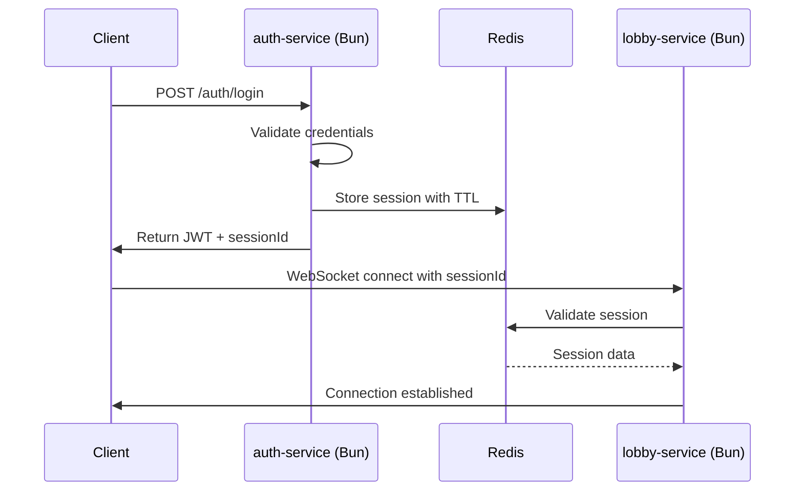
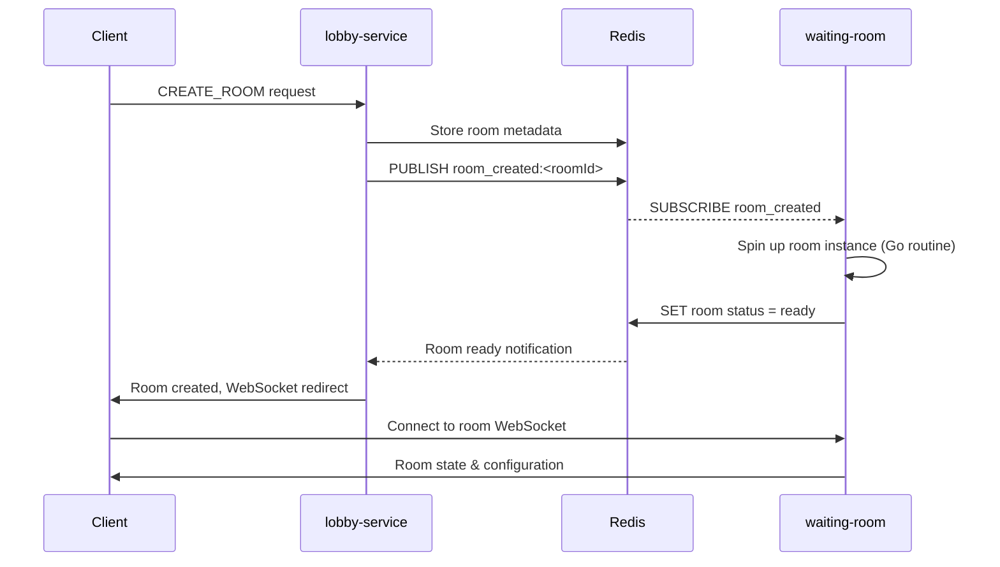
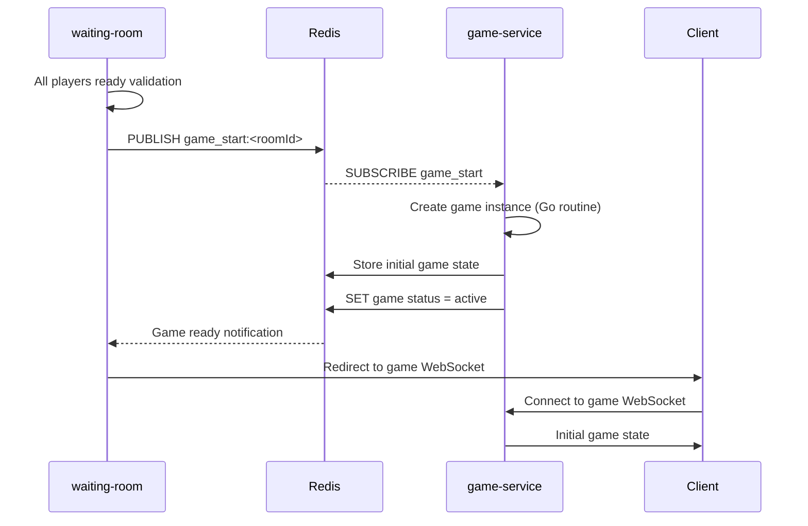

# KingsMaker – Network Architecture (Redis-Centered)

**Version:** 2.0  
**Last updated:** January 2025  
**Architecture:** Redis-Centered Service Separation

---

## 🎯 Purpose

Design a scalable, Redis-centered multiplayer architecture that supports:
• **Bun services** for rapid I/O (auth, lobby)
• **Go services** for high-concurrency game logic
• **Redis** as central state manager and pub/sub coordinator
• Clear service boundaries with isolated responsibilities
• Solo developer-friendly deployment and maintenance

---

## 🏗️ Service Architecture

### Core Services

| Service | Language | Port | Role | Redis Integration |
|---------|----------|------|------|-------------------|
| **auth-service** | Bun | 3000 | Authentication & Sessions | Session storage with TTL |
| **lobby-service** | Bun | 3001 | Room discovery & WebSocket | Room state reading, player events |
| **waiting-room** | Go | 3002+ | Pre-game room management | Room state updates, pub/sub |
| **game-service** | Go | 4000+ | Game instance logic | Game state persistence, events |
| **redis-manager** | Redis | 6379 | Central state & pub/sub | Core data storage |

### Service Communication Matrix

```
Client ←→ auth-service (HTTP/JWT)
Client ←→ lobby-service (WebSocket)
Client ←→ waiting-room (WebSocket via room-specific connection)
Client ←→ game-service (WebSocket via game-specific connection)

All services ←→ Redis (State & Pub/Sub)
```

---

## 🔑 Authentication & Session Flow

### Token & Identity Management

| Type | Format | Scope | Storage | Lifetime |
|------|--------|-------|---------|----------|
| **authToken** | JWT (HS256) | Registered users | Redis + Client | 24h sliding |  
| **guestSession** | `guest_<uuid>` | Guest users | Redis + Client | Browser session |
| **sessionId** | UUID | WebSocket connection | Redis | Connection lifetime |

### Authentication Sequence


---

## 🔄 Redis State Management

### Key Structure Design

```typescript
// Session Management
"loggedInUsers:<sessionId>": {
  userId: string;
  userType: "registered" | "guest";
  username: string;
  connectedAt: string;
} // TTL: 24 hours

// Room State
"waitingRooms:<roomId>": {
  id: string;
  name: string;
  hostId: string;
  state: "WAITING" | "STARTING" | "IN_PROGRESS";
  maxPlayers: number;
  currentPlayerCount: number;
  createdAt: string;
} // TTL: 2 hours idle

// Active Games
"games:<gameId>": {
  roomId: string;
  state: "STARTING" | "ACTIVE" | "PAUSED" | "FINISHED";
  players: string[];
  currentPhase: string;
  lastActivity: string;
} // TTL: 4 hours idle

// Player Location Tracking
"playerLocation:<userId>": {
  location: "lobby" | "waiting-room" | "game";
  roomId?: string;
  gameId?: string;
  lastSeen: string;
} // TTL: 30 minutes
```

### Pub/Sub Event Channels

| Channel | Publisher | Subscribers | Purpose |
|---------|-----------|-------------|---------|
| `room_created:<roomId>` | lobby-service | waiting-room | New room initialization |
| `room_closed:<roomId>` | waiting-room/game-service | lobby-service | Room cleanup |
| `game_start:<roomId>` | waiting-room | game-service | Game instance creation |
| `game_end:<gameId>` | game-service | lobby-service | Return players to lobby |
| `player_joined:<roomId>` | lobby-service | waiting-room | Player room entry |
| `player_left:<roomId>` | waiting-room | lobby-service | Player room exit |

---

## 🌐 WebSocket Connection Strategy

### Multi-Connection Architecture

**Client maintains multiple WebSocket connections:**

1. **Primary Lobby Connection** → `lobby-service:3001/lobby`
   - Room discovery and player lists
   - Always connected when authenticated
   - Handles room join/leave requests

2. **Room-Specific Connection** → `waiting-room:3002+/room/<roomId>`
   - Pre-game setup and configuration
   - Player readiness and character setup
   - Connected only when in a waiting room

3. **Game-Specific Connection** → `game-service:4000+/game/<gameId>`
   - Active gameplay actions and state
   - Turn management and game events
   - Connected only during active games

### Connection Management Rules

- **Sequential Connections**: Client connects to lobby first, then room/game as needed
- **Graceful Transitions**: Previous connection closes when moving to next service
- **Reconnection Logic**: Each service handles its own reconnection independently
- **State Synchronization**: Redis ensures consistent state across service boundaries

---

## 🔗 Service Communication Flows

### Room Creation & Join Flow



### Game Start Transition



---

## 📊 Data Models & Message Protocols

### Core Message Envelope

```typescript
interface MessageEnvelope<T extends string, P> {
  type: T;
  timestamp: number; // Unix epoch ms
  sessionId: string;
  roomId?: string;
  gameId?: string;
  payload: P;
}
```

### Service-Specific Message Types

```typescript
// Auth Service Messages (HTTP REST)
interface AuthMessages {
  "POST /auth/login": { email: string; password: string };
  "POST /auth/guest": { nickname: string };
  "POST /auth/refresh": { refreshToken: string };
}

// Lobby Service Messages (WebSocket)
interface LobbyMessages {
  "GET_ROOMS": {};
  "CREATE_ROOM": { name: string; maxPlayers: 2|3|4 };
  "JOIN_ROOM": { roomId: string };
  "LEAVE_ROOM": { roomId: string };
}

// Waiting Room Messages (WebSocket)
interface WaitingRoomMessages {
  "UPDATE_CHARACTER": { character: CharacterSetup };
  "TOGGLE_READY": { isReady: boolean };
  "UPDATE_ROOM_CONFIG": { config: RoomConfig }; // Host only
  "START_GAME": {}; // Host only
}

// Game Service Messages (WebSocket)
interface GameMessages {
  "PLAYER_ACTION": { action: GameAction };
  "END_TURN": {};
  "PAUSE_GAME": {};
  "RESUME_GAME": {};
}
```

---

## 🛡️ Security & Anti-Cheat Strategy

### Authentication Security
- **JWT Signing**: HS256 with rotating secrets
- **Session Validation**: Redis-based session verification on each request
- **Rate Limiting**: Per-user and per-IP request throttling
- **Guest Isolation**: Limited permissions and automatic cleanup

### Game State Security
- **Server Authority**: All game logic executed server-side only
- **Action Validation**: Every client action validated against game rules
- **State Integrity**: Game state stored in Redis with checksums
- **Replay Logging**: Complete action history for audit/debugging

### Network Security
- **WebSocket Authentication**: Session token required for all WS connections
- **Message Validation**: Schema validation on all incoming messages
- **Connection Limits**: Max connections per user/IP address
- **DDoS Protection**: Rate limiting and connection throttling

---

## 📈 Performance & Scalability

### Redis Performance Optimization

```typescript
// Redis Configuration for Performance
const redisConfig = {
  // Connection pooling
  pool: {
    min: 5,
    max: 20,
    acquireTimeoutMillis: 30000,
  },
  
  // Memory optimization
  maxMemoryPolicy: 'allkeys-lru',
  
  // Persistence configuration
  persistence: {
    rdb: {
      enabled: true,
      interval: 900, // 15 minutes
    },
    aof: {
      enabled: false, // Disabled for performance
    }
  },
  
  // Pub/Sub optimization
  pubsub: {
    maxClients: 1000,
    timeout: 30000,
  }
};
```

### Service Scaling Strategy

| Service | Scaling Method | Bottleneck | Solution |
|---------|----------------|------------|----------|
| **auth-service** | Horizontal (stateless) | JWT validation | Redis session cache |
| **lobby-service** | Horizontal (Redis-backed) | WebSocket connections | Load balancer with sticky sessions |
| **waiting-room** | Vertical (per-room instances) | Memory per room | Go routine efficiency |
| **game-service** | Vertical (per-game instances) | CPU per game | Isolated game processes |

### Performance Targets

- **Lobby Response Time**: < 100ms for room operations
- **WebSocket Latency**: < 50ms for real-time updates  
- **Game Action Processing**: < 200ms for turn-based actions
- **Concurrent Users**: 1000+ simultaneous connections
- **Concurrent Games**: 100+ active game instances

---

## 🚀 Deployment & Infrastructure

### Development Environment
```yaml
# docker-compose.dev.yml
version: '3.8'
services:
  redis:
    image: redis:7-alpine
    ports: ["6379:6379"]
    
  auth-service:
    build: ./services/auth
    ports: ["3000:3000"]
    depends_on: [redis]
    
  lobby-service:
    build: ./services/lobby  
    ports: ["3001:3001"]
    depends_on: [redis]
```

### Production Considerations
- **Redis Clustering**: Multi-node Redis setup for high availability
- **Load Balancing**: NGINX for WebSocket connection distribution
- **Monitoring**: Prometheus + Grafana for service metrics
- **Logging**: Centralized logging with structured JSON output
- **Health Checks**: Endpoint monitoring for all services

---

## 🔧 Implementation Roadmap

### Phase 1: Core Infrastructure ✅
- [x] Redis setup and configuration
- [x] auth-service implementation (Bun)
- [x] Basic session management
- [x] JWT token handling

### Phase 2: Lobby System 🔄
- [ ] lobby-service WebSocket implementation
- [ ] Room creation and discovery
- [ ] Redis state management integration
- [ ] Player location tracking

### Phase 3: Game Flow 📋
- [ ] waiting-room service (Go)
- [ ] Room state management and transitions
- [ ] game-service architecture (Go)
- [ ] Complete game flow integration

### Phase 4: Polish & Scale 🚀
- [ ] Performance optimization
- [ ] Security hardening
- [ ] Monitoring and observability
- [ ] Production deployment automation

---

## 🎮 Benefits of This Architecture

### For Solo Developer
- **Technology Alignment**: Bun for rapid development, Go for performance
- **Reduced Complexity**: Redis eliminates complex service coordination
- **Clear Boundaries**: Each service has focused, well-defined responsibilities
- **Incremental Development**: Can build and test each service independently

### For Users
- **Low Latency**: Optimized WebSocket connections and Redis state access
- **Reliability**: Service isolation prevents cascading failures
- **Scalability**: Architecture supports growth from dozens to thousands of users
- **Responsive Experience**: Real-time updates across all game phases

This architecture provides a solid foundation for building a modern, scalable multiplayer game while remaining manageable for a solo developer. 